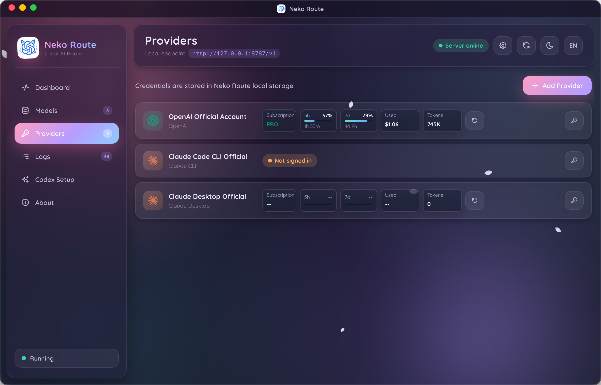
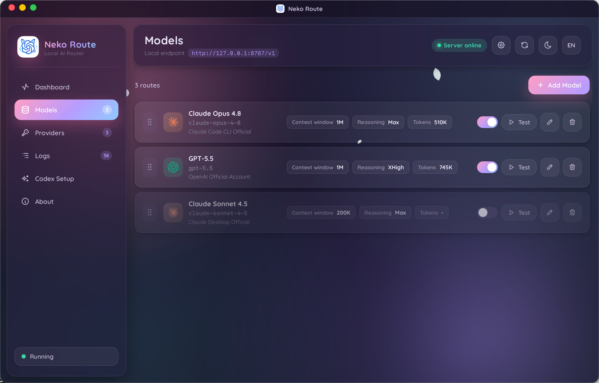

<div align="center">

# Neko Route

Local AI Router for Codex. A desktop control plane for model routing, official account access, provider management, request observability, and Codex catalog generation.

[English](README.md) | [简体中文](README.zh-CN.md) | [繁體中文](README.zh-TW.md) | [日本語](README.ja.md) | [Changelog](CHANGELOG.md)


</div>

## Overview

Neko Route is a local desktop router designed for Codex. It exposes a local OpenAI-compatible entrypoint, generates the Codex model catalog and configuration, and routes requests to official OpenAI accounts, official Claude sources, or third-party API providers.

The project focuses on three goals:

- **Provider independence**: keep Codex pointed at one local endpoint while Neko Route decides where each model request should go.
- **Operational visibility**: inspect request history, routing results, token usage, stream status, subscription state, and provider quota from one desktop app.
- **Local-first credential handling**: keep tokens and API keys outside the Codex catalog and store sensitive values through the app's credential storage path.

## Preview

<p align="center">
  
</p>

<p align="center">
  
</p>

## Core Capabilities

- Local `/v1/responses` routing for Codex with model-level provider selection.
- Codex model catalog export with text and image input support.
- Official OpenAI account authorization through Codex-compatible OAuth or Codex JSON.
- Official Claude account authorization through manual OAuth, cookie-assisted OAuth, or Claude JSON.
- Claude Code CLI and Claude Desktop official credential detection.
- Third-party OpenAI Responses, OpenAI Chat Completions, and Anthropic Messages provider support.
- Duplicate model ID protection, default model repair, fallback model routing, and disabled-model ordering.
- Request logs with routed provider, stream state, token usage, cost estimate, and final latency badge.
- GitHub Releases based updater with release notes shown inside the app.
- Single-instance desktop behavior with existing-window focus on repeated launch.

## Architecture

Neko Route is built as a Tauri 2 desktop application with a Rust backend and a React frontend.

| Layer | Responsibility |
| --- | --- |
| Desktop app | Provider setup, model management, Codex configuration, updates, request logs |
| Local router | OpenAI-compatible endpoints used by Codex |
| Provider adapters | OpenAI Responses, OpenAI Chat Completions, Anthropic Messages, official account routes |
| Catalog exporter | Codex model catalog and configuration generation |
| Credential storage | Provider tokens, API keys, and official account token JSON |

Codex talks to the local router. Neko Route then maps the requested model ID to the configured provider, rewrites the upstream model when needed, and preserves supported input content such as images and files for compatible protocols.

## Provider Model

Neko Route separates official account sources from generic API providers.

| Source | Purpose |
| --- | --- |
| OpenAI Official Account | Routes through an OpenAI account token and displays subscription and quota data |
| Claude Official Account | Routes through a Claude account token and displays subscription and usage data when available |
| Claude Code CLI Official | Uses locally available Claude Code CLI credentials |
| Claude Desktop Official | Uses locally available Claude Desktop credentials |
| Third-party API | Routes to custom OpenAI-compatible or Anthropic-compatible providers |

## Model Catalog

Models are defined as Codex-facing entries. A model can use the same public ID as its upstream model, or it can point to a different upstream name while keeping the Codex-visible ID stable.

Neko Route keeps only one enabled entry for the same model ID at a time. This avoids Codex catalog conflicts while still allowing multiple saved configurations for the same ID.

## Observability

The dashboard and logs are designed for routing inspection:

- Requested model and matched provider.
- Completion state and stream state.
- Prompt, completion, cache, and total token usage.
- Final latency badge.
- Provider quota and subscription cards for supported official sources.
- Clear upstream error messages when a provider rejects a request.

## Security Boundary

Neko Route is a local control-plane app. It is designed to keep provider credentials out of generated Codex catalog files and route configuration.

Sensitive values are stored through the app's credential storage flow. If the platform keychain cannot store a value, Neko Route falls back to its local token storage path with strict handling in the backend.

## Releases

Downloads are published through [GitHub Releases](https://github.com/zoefix/neko-route/releases). The desktop updater reads release metadata from GitHub and shows the current release notes in the app before installation.

macOS can also be installed with Homebrew:

```bash
brew install --cask zoefix/neko-route/neko-route
```

Update the Homebrew installation:

```bash
brew update && brew upgrade --cask neko-route
```

Supported desktop platforms:

- Windows
- macOS
- Linux

## Development

Common local checks:

```bash
corepack pnpm build
cargo test --manifest-path src-tauri/Cargo.toml
cargo fmt --manifest-path src-tauri/Cargo.toml -- --check
git diff --check
```

Windows installers are produced only through the project release/build scripts when an installer artifact is needed.
